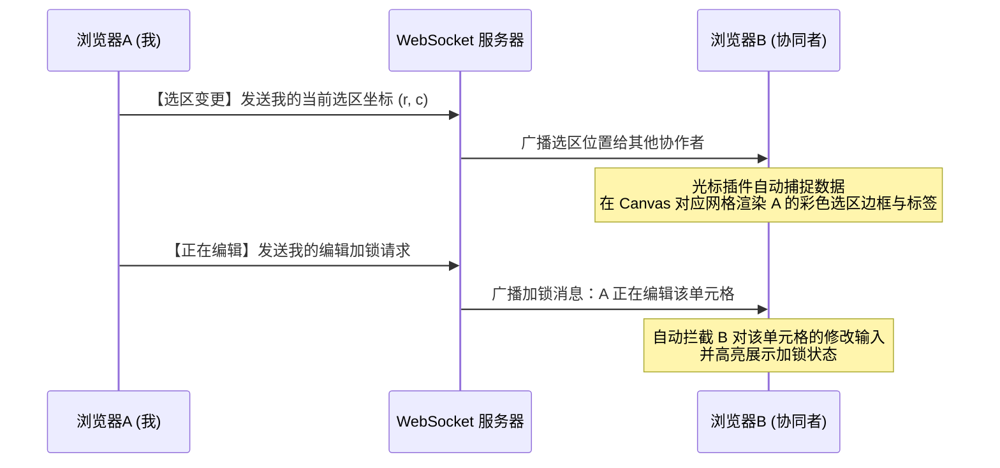

# 📘 Vue Canvas Sheet 开发者进阶用法指南 (Developer Guide)

本指南针对 `samples/basic-usage` 中的三个核心演示模块进行深度剖析，提供具体的代码范式、API 规范以及高级集成方案，帮助你快速掌握高性能 Canvas 电子表格引擎的开发与调优。

---

## 🎯 目录
1. [📊 基础操作与超大规模数据加载 (AppBasic.vue)](#1-基础操作与超大规模数据加载-appbasicvue)
2. [🎨 动态单元格样式与边框控制 (AppRandom.vue)](#2-动态单元格样式与边框控制-apprandomvue)
3. [👥 实时在线协同与光标同步集成 (AppCollab.vue)](#3-实时在线协同与光标同步集成-appcollabvue)
4. [⚡ WASM 公式引擎调优与环境要求](#4-wasm-公式引擎调优与环境要求)

---

## 1. 📊 基础操作与超大规模数据加载 (AppBasic.vue)

在 `AppBasic.vue` 中，主要展示了**如何操作基础的 Workbook API**、**批量加载超大规模数据**，以及**引入核心辅助插件**。

### 1.1 插件装载与调用

插件是扩展电子表格能力的推荐方式。在集成时，应将插件实例挂载到 `TableDesigner` 组件的 `:plugins` 属性上：

```javascript
import { 
  TableDesigner, 
  createSelectionHistoryPlugin, 
  createExportPlugin, 
  createImportPlugin 
} from 'vue-canvas-sheet';

// 实例化选区历史纪录插件（用于控制撤销/重做选区状态）
const historyPlugin = createSelectionHistoryPlugin({ maxSize: 50 });

// 实例化导出插件 (支持 Excel, JSON, CSV)
const exportPlugin = createExportPlugin({ defaultFileName: "my-data" });

// 实例化导入插件 (支持读取并渲染文件)
const importPlugin = createImportPlugin({
  onComplete: (result) => console.log("导入成功:", result),
  onError: (error) => console.error("导入失败:", error)
});

// 装载到组件的 plugins 列表中
const designerPlugins = [historyPlugin, exportPlugin, importPlugin];
```

#### 调用插件 API：
```javascript
// 执行导出
exportPlugin.exportExcel({ fileName: "report.xlsx" });

// 触发导入
importPlugin.importFile(fileObject);
```

### 1.2 5W 行大数据瞬时载入与批量重算

对于超大规模的数据，逐个调用 `setCell` 触发重绘会导致严重的渲染卡顿。在 `AppBasic.vue` 中，展示了**极速全量赋值与多线程重算**的最佳实践：

```javascript
const loadBigData = () => {
  if (table.value && table.value.workbook) {
    const wb = table.value.workbook;
    const ROWS = 50000;
    const data = new Array(ROWS);

    // 1. 构建超大内存数据矩阵
    for (let i = 0; i < ROWS; i++) {
      data[i] = [
        i,                      // 纯数值
        i * 2, 
        i * 3, 
        { f: `=SUM(A${i+1}:C${i+1})` } // 引入动态公式
      ];
    }

    // 2. 利用 setData 一键覆盖主内存，避免多次零散重绘
    wb.setData(data);

    // 3. 强制启动 WASM 独立线程（Worker）并发完成 5W 行公式的重算
    wb.recalcAll({ useWorker: true });
  }
};
```

### 1.3 获取引擎诊断报告 (Diagnostics)

在做应用调优时，你可以通过 `Workbook` 的性能诊断接口获取运行指标，用于性能调优展示：

```javascript
const report = table.value.workbook.getSystemReport();

console.log("诊断指标清单：", {
  version: report.version,                         // 引擎版本
  wasmSupported: report.environment.wasmSupported, // WASM 支持情况
  sharedArrayBuffer: report.environment.sharedArrayBuffer, // 共享内存是否激活
  formulasEvaluated: report.calculation.formulasEvaluated, // 历史公式计算总量
  lastDuration: report.calculation.lastDuration    // 最近一次计算总耗时（毫秒）
});
```

---

## 2. 🎨 动态单元格样式与边框控制 (AppRandom.vue)

`AppRandom.vue` 展示了如何利用 `Workbook` API 编程化地控制电子表格的单元格样式、数字格式、区域边框、跨单元格合并等表现层功能。

### 2.1 单元格配置结构 (Cell Schema)

你可以通过直接向 `initialData` 传入富文本对象或使用 `wb.setCell` 来控制单元格。标准的单元格数据结构如下：

```javascript
const cellData = {
  v: 100, // 单元格的值 (value)，支持字符串、数字、布尔值
  f: "=A1+B1", // [可选] 公式字符串 (formula)
  s: { // [可选] 样式对象 (style)
    bold: true,              // 字体加粗
    italic: true,            // 字体斜体
    td: 'line-through',      // 文字修饰：下划线('underline') 或 删除线('line-through')
    color: '#ef4444',        // 文本前景色
    bg: '#fef3c7',           // 单元格背景色
    fontSize: 14,            // 字体大小 (px)
    align: 'center',         // 水平对齐：'left' | 'center' | 'right'
    valign: 'middle',        // 垂直对齐：'top' | 'middle' | 'bottom'
    wrap: true,              // 是否自动换行
    fmt: 'percent',          // 数字格式：'percent' (百分比) | 'comma' (千分位)
    decimals: 1              // 保留小数位数
  }
};
```

### 2.2 批量边框绘制 (Border Control)

调用 `wb.setBorder` 可以一键为指定区域渲染边框，提升视觉可读性：

```javascript
const wb = table.value.workbook;

// 为整个数据区域（0行0列 到 30行7列）添加淡灰色实线网格边框
wb.setBorder(
  { 
    s: { r: 0, c: 0 }, 
    e: { r: 30, c: 7 } 
  },
  'all',      // 边框应用范围：'all' | 'outer' | 'inner' | 'left' | 'right' | 'top' | 'bottom'
  '#cbd5e1',  // 边框颜色
  'solid'     // 边框类型：'solid' (实线) | 'dashed' (虚线) | 'dotted' (点线)
);
```

### 2.3 动态追加数据与汇总公式行

在表格末尾以编程化方式动态追加一行汇总数据并应用专属的高亮样式：

```javascript
const addSummaryRow = (lastDataRow) => {
  const wb = table.value.workbook;
  const summaryRowIndex = lastDataRow + 1;

  // 1. 设置文本标识并配置高亮黑金主题样式
  wb.setCell(summaryRowIndex, 0, {
    v: '总计 (Total)',
    s: { bold: true, align: 'right', bg: '#0f172a', color: '#fde68a' }
  });

  // 2. 动态追加公式单元格，统计前面所有行的总和
  wb.setCell(summaryRowIndex, 3, {
    f: `=SUM(D2:D${lastDataRow + 1})`,
    s: { bold: true, fmt: 'comma', decimals: 0, bg: '#fef3c7' }
  });

  // 3. 动态追加公式单元格，统计前面所有行的平均值
  wb.setCell(summaryRowIndex, 4, {
    f: `=AVERAGE(E2:E${lastDataRow + 1})`,
    s: { bold: true, fmt: 'percent', decimals: 1, align: 'center', bg: '#fef3c7' }
  });

  // 4. 重算并绘制表格
  wb.recalcAll({ useWorker: true });
};
```

---

## 3. 👥 实时在线协同与光标同步集成 (AppCollab.vue)

`AppCollab.vue` 展示了如何利用组件内置的**协作通信插件**对接协同服务器，实现多人在线协作、远程选区与光标的绘制。

### 3.1 协同插件配置与装载

在 Vue 中对接协同，需要装载协作光标插件 `CollaborativeCursorPlugin` 以及实时传输插件 `RealtimeCollaborationPlugin`：

```javascript
import { 
  createCollaborativeCursorPlugin, 
  createRealtimeCollaborationPlugin 
} from 'vue-canvas-sheet';

// 1. 实例化远程光标绘制插件
const cursorPlugin = createCollaborativeCursorPlugin({ 
  expireTime: 15000 // 远程未活跃用户的光标在 15 秒后自动消失
});

// 2. 实例化 WebSocket 传输插件
const collabPlugin = createRealtimeCollaborationPlugin({
  serverUrl: 'ws://your-collab-server.com:3030', // 协同消息中转服务器地址
  roomId: 'project-dashboard-room-1',           // 协作空间/房间 ID
  userId: 'user_1001',                            // 当前用户的唯一 ID
  userName: '约翰·阿姆斯特朗',                    // 当前用户名
  userColor: '#3498db'                            // 当前用户光标的专属渲染色
});

// ❗️ 特别注意：必须确保 cursorPlugin 排在 collabPlugin 的前面
const plugins = [cursorPlugin, collabPlugin];
```

### 3.2 协作行为原理解析

协作插件在激活后，会在幕后自动完成以下复杂事务：



---

## 4. ⚡ WASM 公式引擎调优与环境要求

为了让后台的多线程公式计算引擎（Wasm Engine）跑出最强性能，生产环境服务器推荐开启**跨源隔离（Cross-Origin Isolation）**。

### 4.1 跨源隔离响应头设置

如果你在 Nginx、Vite 或其他生产服务器上托管你的静态项目，设置以下两个响应头，即可强力解锁多线程底层共享内存模式（启用 `SharedArrayBuffer`）：

```http
Cross-Origin-Opener-Policy: same-origin
Cross-Origin-Embedder-Policy: require-corp
```

#### 开启与未开启性能比对：
* **跨源隔离开启（⚡ 零拷贝）**：WASM 计算引擎可以直接通过底层 `SharedArrayBuffer` 与浏览器主线程进行超大内存块的快速数据读写。50,000 行公式重算仅需几毫秒。
* **跨源隔离未开启（🐢 串行拷贝）**：由于浏览器安全限制，`SharedArrayBuffer` 无法实例化。引擎会自动降级到主线程完成重算，当数据量过大时可能会引起短暂的界面微卡顿。你可以放心地在未隔离的环境（如 GitHub Pages）中使用降级模式，该组件已具备完美的静默平滑降级机制。
